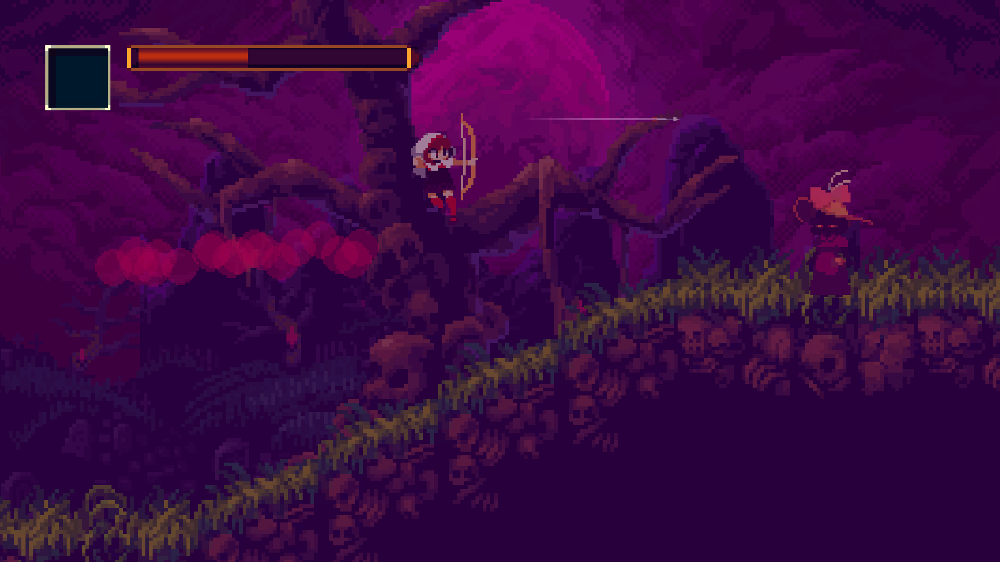
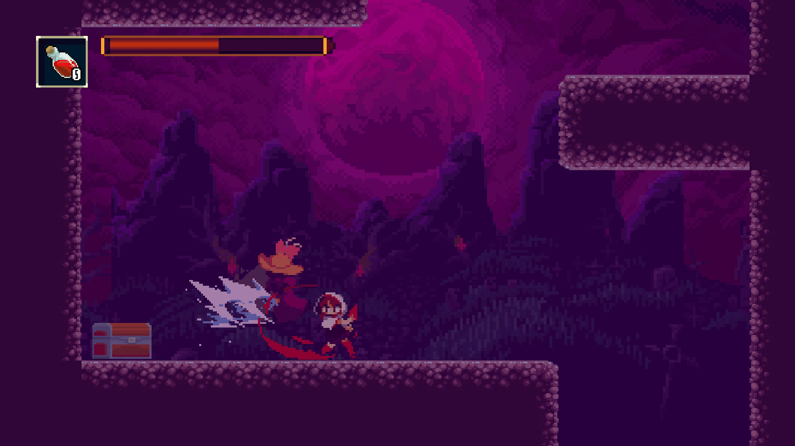
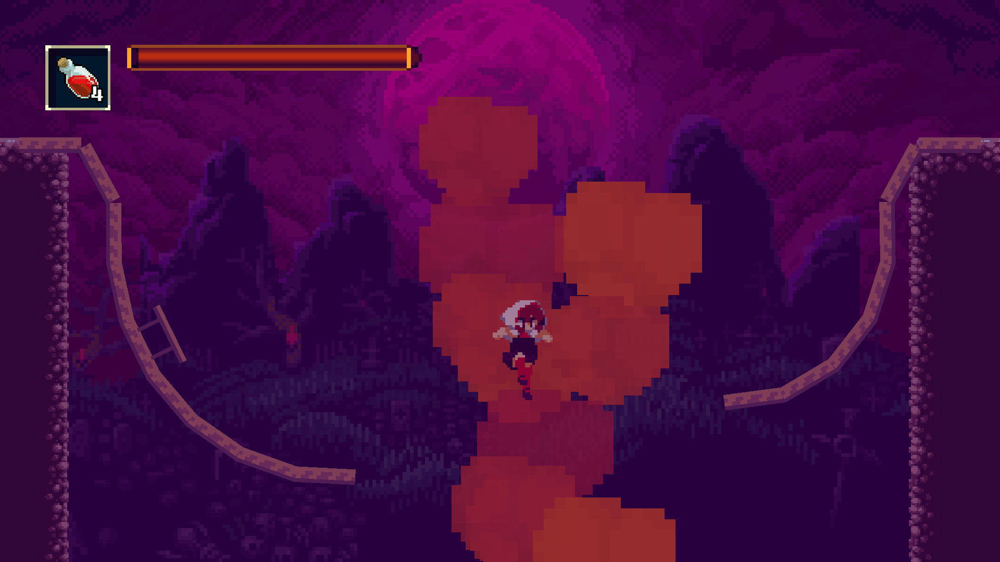
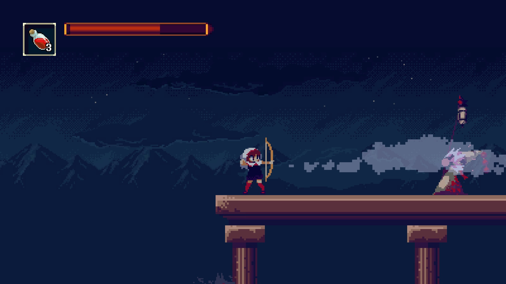
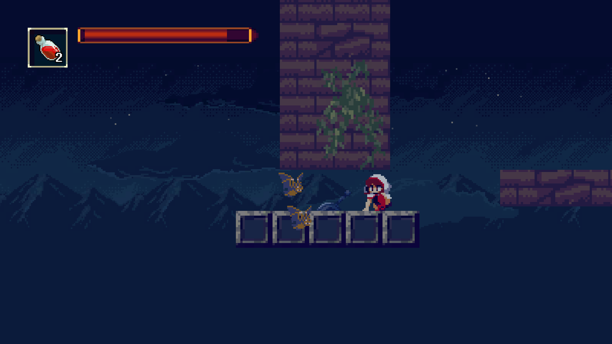
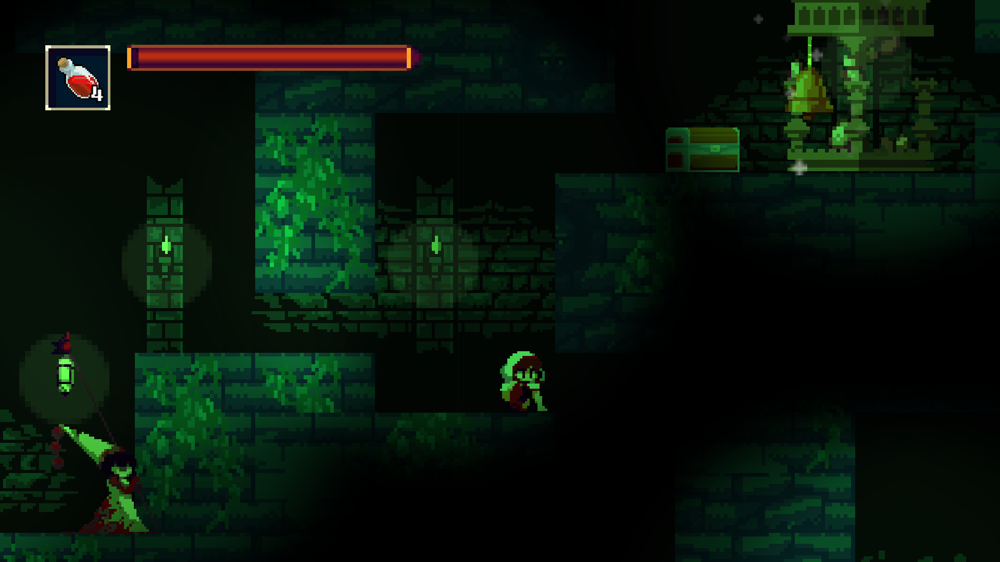
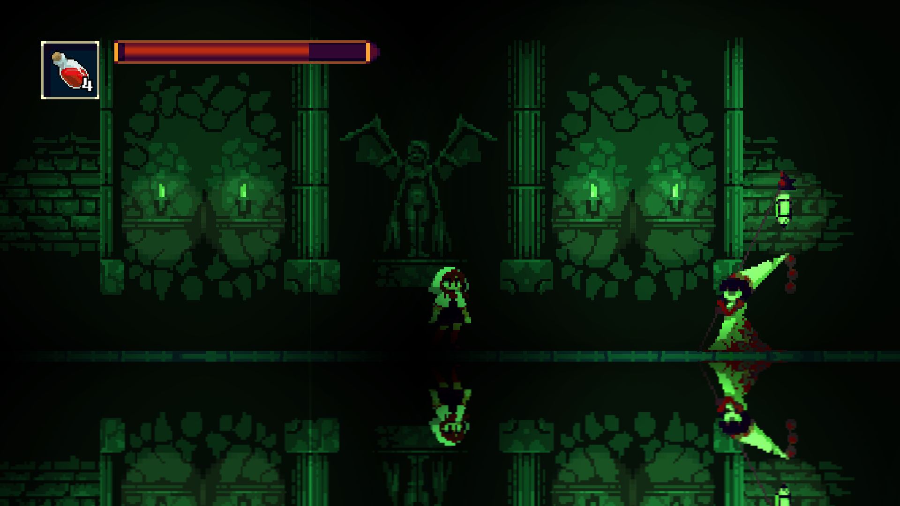
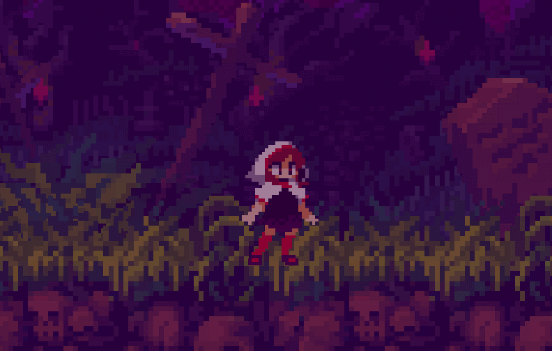
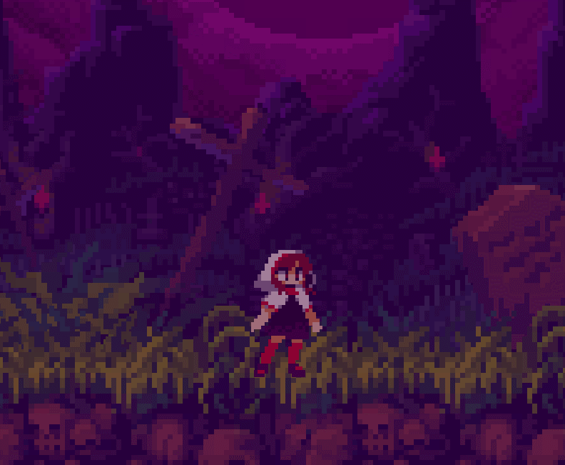
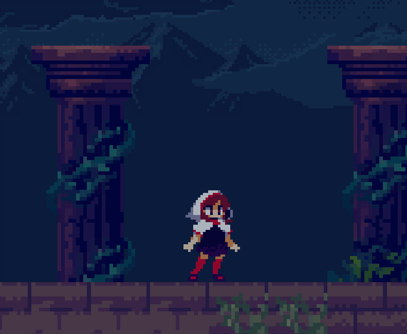

# NightRip
<h2>모모도라 팬게임</h2>

  학교과제로 만들었습니다.

<table border="0">
	<tr>
	    <td>  </td>
	    <td>  </td>
	    <td>  </td>
	    <td>  </td>
	</tr>
	<tr align ="center">
	    <td>대기상태</td>
	    <td>공격</td>
	    <td>화살</td>
            <td>포션</td>
	</tr>
    </table>

<h3>조작</h3>
<table border="0">
	<tr  align ="center">
		<td><h5>PC 버전 조작</h5></td>
		<td><h5>XBOX 버전 조작</h5></td>
	</tr>
	<tr>
	    <td>
		    <table border="0">
			<tr>
	    			<td>이동 : 방향키 </td>
	    			<td>점프 : Space </td>
				<td>회피 : D </td>
			</tr>
			<tr>
	    			<td>공격 : A </td>
	    			<td>화살 : S </td>
				<td> </td>			
			</tr>
  			<tr>
				<td>아이템 사용 : F </td>
	    			<td>아이템 교체 : Q </td>
				<td>메뉴 : ESC </td>
			</tr>
    		    </table>
	    </td>
	    <td>
		    <table border="0">
			<tr>
	    			<td>이동 : LStick </td>
	    			<td>점프 : A </td>
				<td>회피 : RT </td>
			</tr>
			<tr>
	    			<td>공격 : X </td>
	    			<td>화살 : B </td>
				<td> </td>			
			</tr>
  			<tr>
				<td>아이템 사용 : Y </td>
	    			<td>아이템 교체 : LT </td>
				<td>메뉴 : Back </td>
			</tr>
    	            </table>
	    </td>
	</tr>
</table>

<h1> ※ Game 파일에 게임이 들어있어요!! ※ </h1>

<플레이 영상 : https://www.youtube.com/watch?v=pSGuGgblZEk&t=70s>
